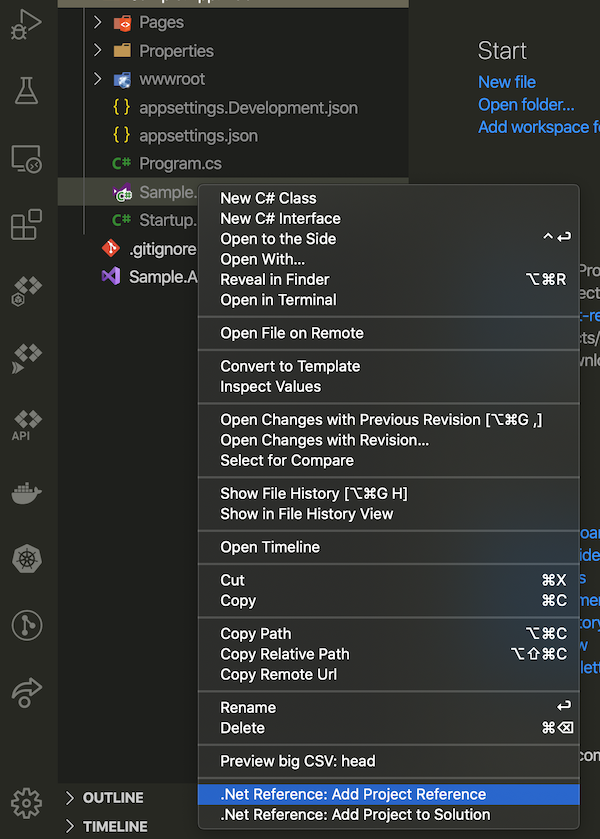
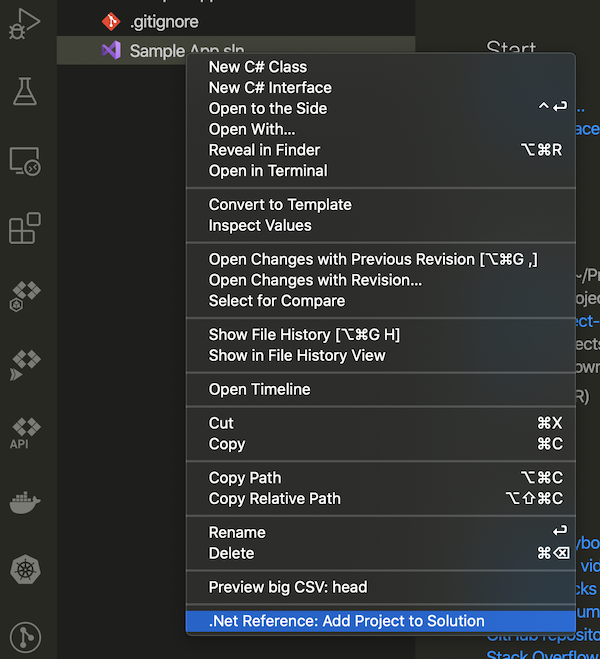

# dotnet-project-references

A simple VS Code extension to manage project references for dotnet workspaces.

## Features

Currently the extension only supports adding project references to the following file types:
- .csproj 
- .sln

## Requirements

This extension expects you to have dotnet core installed and to have the *dotnet* binary in your PATH.

## Release Notes

Users appreciate release notes as you update your extension.

### 0.0.1

Our very first release includes:
- Add project reference to .csproj
- Add project reference to .sln
